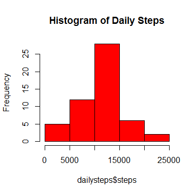
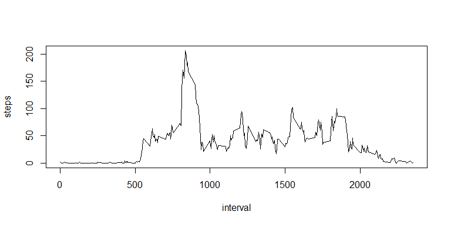
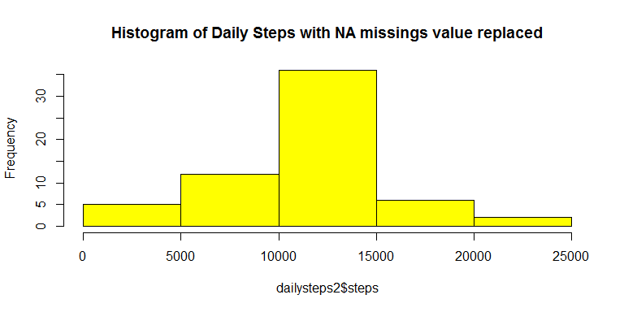
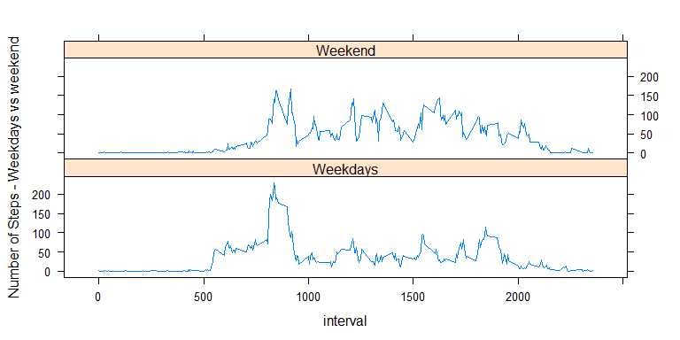

# Reproducible Research: Peer Assessment 1


## Analysis of Personal Movement Using Activity Monitoring Devices - Week 2 Assignment 

## 1.Code for reading in the dataset and/or processing the data


```r
data<-read.csv("activity.csv")
head(data)
```

```
##   steps       date interval
## 1    NA 2012-10-01        0
## 2    NA 2012-10-01        5
## 3    NA 2012-10-01       10
## 4    NA 2012-10-01       15
## 5    NA 2012-10-01       20
## 6    NA 2012-10-01       25
```

## 2.Histogram of the total number of steps taken each day


```r
dailysteps<-aggregate(steps ~ date,data, sum,na.rm=TRUE)
hist(dailysteps$steps,col="red", main="Histogram of Daily Steps")
```

<!-- -->


## 3.Mean and median number of steps taken each day


```r
mean(dailysteps$steps,na.rm=TRUE)
```

```
## [1] 10766.19
```

```r
median(dailysteps$steps,na.rm=TRUE)
```

```
## [1] 10765
```


## 4. Time series plot of the average number of steps taken

```r
timesteps<-aggregate(steps ~ interval,data, mean,na.rm=TRUE)
plot(steps ~ interval,timesteps, type="l" )
```

<!-- -->


## 5. The 5-minute interval that, on average, contains the maximum number of steps

```r
timesteps$interval[timesteps$steps == max(timesteps$steps)]
```

```
## [1] 835
```


## 6.Code to describe and show a strategy for imputing missing data
Missings value will be replaced by interval by the average of the equivalent available interval

```r
sum(is.na(data$steps))
```

```
## [1] 2304
```

## 7.create a new dataset that is equal to the original but with the missing data filled in. 

```r
data2<-data
data2<-merge(data2,timesteps,by="interval")
data2$steps<-data2$steps.x
data2$steps[is.na(data2$steps.x)] <- data2$steps.y[is.na(data2$steps.x)]

dailysteps2<-aggregate(steps ~ date,data2, sum)
hist(dailysteps2$steps,col="yellow", main="Histogram of Daily Steps with NA missings value replaced")
```

<!-- -->

## 8.Panel plot comparing the average number of steps taken per 5-minute interval across weekdays and weekends


```r
data2$date <- as.Date(data2$date, format = "%Y-%m-%d")
data2$day<-as.factor(weekdays(data2$date))

data2$weekday <- ifelse((data2$day %in% c("Saturday","Sunday")), "Weekend", "Weekdays") 

weekdayssteps<- aggregate(steps ~ weekday + interval,data2, mean)

library(lattice)
xyplot(steps ~  interval | weekday, data = weekdayssteps, layout = c(1,2), type ="l", ylab="Number of Steps - Weekdays vs weekend")
```

<!-- -->
